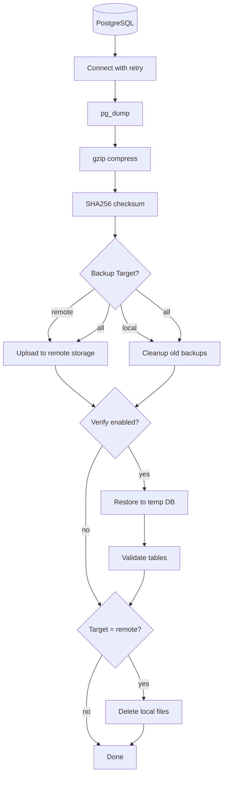

# postgres-backup-job

Python automation for PostgreSQL backups with gzip compression.

## Features

- **pg_dump backup** — Full database dump
- **gzip compression** — Reduce backup size by 70-90%
- **SHA256 checksum** — Backup integrity verification
- **Storage strategy** — Local, remote (S3-compatible), or both
- **Retention policy** — Auto-delete backups older than N days
- **Backup verification** — Test restore to validate backup integrity
- **Connection retry** — Automatic retry on connection failure
- **Configurable** — All settings via environment variables

## Project Structure

```
postgres-backup-job/
├── src/
│   ├── backup.py      # Main entry point + backup orchestration
│   ├── config.py      # Configuration from environment variables
│   ├── logger.py      # Logging setup
│   ├── database.py    # PostgreSQL connection, verify, restore
│   ├── storage.py     # Local/remote storage, cleanup
│   └── checksum.py    # SHA256 checksum generation
├── charts/            # Helm chart (see K8s Deployment section)
├── tests/             # Unit tests (pytest)
├── backups/           # Local backup storage (gitignored)
├── init-scripts/      # Sample data for development
├── Dockerfile         # Multi-stage production image
├── docker-compose.yml # Development environment
├── Makefile           # K8s deployment commands
├── requirements.txt   # Python dependencies
└── .env.example       # Environment template
```

| Module | Responsibility |
|--------|---------------|
| `backup.py` | Main flow: dump → compress → checksum → upload → verify |
| `config.py` | Read all settings from environment variables |
| `logger.py` | Consistent log format with timestamps |
| `database.py` | Connect with retry, create/drop temp DB, restore & verify |
| `storage.py` | Local/remote storage, backup directory, cleanup |
| `checksum.py` | Generate SHA256 checksum files |

## Backup Flow



## Quick Start

```bash
# 1. Configure environment
cp .env.example .env

# 2. Start PostgreSQL (for development)
docker compose up -d

# 3. Install dependencies
pip install -r requirements.txt

# 4. Run backup
python src/backup.py
```

## Configuration

| Variable | Default | Description |
|----------|---------|-------------|
| `POSTGRES_HOST` | localhost | Database host |
| `POSTGRES_PORT` | 5432 | Database port |
| `POSTGRES_USER` | backup_user | Database username |
| `POSTGRES_PASSWORD` | backup_password | Database password |
| `POSTGRES_DB` | testdb | Database name |
| `BACKUP_DIR` | ./backups | Backup output directory |
| `RETRY_COUNT` | 3 | Connection retry attempts |
| `RETRY_DELAY` | 5 | Seconds between retries |
| `RETENTION_DAYS` | 7 | Delete backups older than N days (0=disable) |
| `VERIFY_ENABLED` | false | Enable backup verification |
| `VERIFY_HOST` | POSTGRES_HOST | Verify database host |
| `VERIFY_PORT` | POSTGRES_PORT | Verify database port |
| `VERIFY_USER` | POSTGRES_USER | Verify database user |
| `VERIFY_PASSWORD` | POSTGRES_PASSWORD | Verify database password |
| `VERIFY_DB` | testdb_verify | Temp database for verification |
| `BACKUP_TARGET` | local | Storage target: local, remote, or all |
| `REMOTE_ENDPOINT` | http://localhost:9000 | S3-compatible endpoint |
| `REMOTE_BUCKET` | test-backup | Bucket name |
| `REMOTE_ACCESS_KEY` | minioadmin | Access key |
| `REMOTE_SECRET_KEY` | minioadmin | Secret key |
| `REMOTE_REGION` | us-east-1 | Region |
| `REMOTE_PATH_FORMAT` | monthly | Path format: flat, monthly, or daily |

> **Production Recommendation:** For production environments, use a **separate PostgreSQL instance** for verification to avoid impacting production performance and to validate backup portability.

<details>
<summary>Example: Separate Verify Instance</summary>

Add to `docker-compose.yml`:

```yaml
postgres-verify:
  image: postgres:16-alpine
  environment:
    POSTGRES_USER: backup_user
    POSTGRES_PASSWORD: backup_password
    POSTGRES_DB: testdb_verify
  ports:
    - "5433:5432"
```

Then set in `.env`:
```bash
VERIFY_HOST=localhost
VERIFY_PORT=5433
```

</details>

> **Remote Retention:** Use S3/MinIO lifecycle policies to automatically delete old backups from remote storage.

### Remote Path Formats

| Format | Example Path |
|--------|--------------|
| `flat` | `backup_2026-01-28.sql.gz` |
| `monthly` | `2026-01/backup_2026-01-28.sql.gz` |
| `daily` | `2026-01-28/backup_2026-01-28.sql.gz` |

## Output

### Normal (no cleanup needed)

```
[INFO] Starting backup script...
[INFO] Connected to testdb@localhost:5432
[INFO] Running pg_dump...
[INFO] Compressing backup with gzip...
[INFO] Backup completed: ./backups/backup_2026-01-28.sql.gz (1.3 KB)
[INFO] Cleaning up backups older than 7 days...
[INFO] No old backups to clean up
[INFO] Verifying backup...
[INFO] Creating temp database: testdb_verify
[INFO] Restoring backup to temp database...
[INFO] Verified: 2 tables found
[INFO] Backup verified successfully
[INFO] Dropping temp database: testdb_verify
```

### With cleanup (old backups deleted)

```
[INFO] Starting backup script...
[INFO] Connected to testdb@localhost:5432
[INFO] Running pg_dump...
[INFO] Compressing backup with gzip...
[INFO] Backup completed: ./backups/backup_2026-01-28.sql.gz (1.3 KB)
[INFO] Cleaning up backups older than 7 days...
[INFO] Deleted old backup: backup_2026-01-20.sql.gz
[INFO] Cleanup complete: 1 file(s) removed
[INFO] Verifying backup...
[INFO] Creating temp database: testdb_verify
[INFO] Restoring backup to temp database...
[INFO] Verified: 2 tables found
[INFO] Backup verified successfully
[INFO] Dropping temp database: testdb_verify
```

## Development Setup

```bash
# Start all services (PostgreSQL + MinIO)
docker compose up -d

# Start only PostgreSQL
docker compose up -d postgres

# Start only MinIO
docker compose up -d minio
```

### Verify Services

```bash
# Check PostgreSQL
docker compose exec postgres psql -U backup_user -d testdb -c "SELECT * FROM users;"

# Check MinIO Console
# Open: http://localhost:9001
# Login: minioadmin / minioadmin
```

## Testing

Run unit tests with pytest:

```bash
# Install test dependencies
pip install pytest pytest-mock

# Run all tests
pytest tests/ -v
```

### Test Coverage

| Module | Tests | Description |
|--------|-------|-------------|
| `config.py` | 3 | Environment variable loading, defaults, verify fallback |
| `checksum.py` | 4 | SHA256 generation, format, reproducibility, error handling |
| `storage.py` | 8 | Directory creation, cleanup, S3 upload |
| `database.py` | 5 | Connection success/failure, retry logic |
| **Total** | **20** | |

## Docker Usage

### Build

```bash
docker build -t postgres-backup-job .
```

### Push

```bash
docker tag postgres-backup-job <your-registry>/postgres-backup-job:v1.0.0
docker push <your-registry>/postgres-backup-job:v1.0.0
```

### Pull

```bash
docker pull <your-registry>/postgres-backup-job:v1.0.0
```

### Run

```bash
docker run --rm --network host \
  --env-file .env \
  <your-registry>/postgres-backup-job:v1.0.0
```

## Kubernetes Deployment

### Helm Chart

Chart location: `charts/postgres-backup/`

```
charts/postgres-backup/
├── Chart.yaml          # Chart metadata
├── values.yaml         # Default configuration
└── templates/
    ├── _helpers.tpl    # Template helper functions
    ├── cronjob.yaml    # CronJob for scheduled backups
    ├── pvc.yaml        # PersistentVolumeClaim for local storage
    ├── secret.yaml     # Optional: credentials (demo only)
    └── NOTES.txt       # Post-install instructions
```

| Template | Description |
|----------|-------------|
| `_helpers.tpl` | Template helper functions (naming, labels) |
| `cronjob.yaml` | Scheduled backup job (default: daily 2am) |
| `pvc.yaml` | Local backup storage (auto-created) |
| `secret.yaml` | Demo credentials (see table below) |

### Configuration

Key values in `values.yaml`:

| Value | Default | Description |
|-------|---------|-------------|
| `schedule` | `0 2 * * *` | Cron schedule |
| `persistence.size` | `1Gi` | PVC size |
| `resources.limits.memory` | `256Mi` | Memory limit |
| `resources.limits.cpu` | `100m` | CPU limit |
| `backup.target` | `all` | local, remote, or all |
| `backup.retentionDays` | `7` | Days to keep backups |

**Secret Configuration:**

| Environment | Method |
|-------------|--------|
| Production | `make k8s-secret` |
| Demo/Test | `secret.create: true` |

### Makefile Commands

```bash
make help
```

| Command | Description |
|---------|-------------|
| `k8s-ns` | Create namespace |
| `k8s-secret` | Create secret from .env file |
| `k8s-deploy` | Deploy helm chart |
| `k8s-test` | Trigger backup job and show logs |
| `k8s-logs` | View latest backup logs |
| `k8s-pvc` | List backup files in PVC |
| `k8s-status` | Show all resources status |
| `k8s-download` | Download backups from PVC |
| `k8s-clean` | Delete all resources |

Override variables:

```bash
make k8s-deploy NAMESPACE=production RELEASE=prod IMAGE_TAG=2.0.0
```

### Prerequisites

- Kubernetes cluster (Docker Desktop, minikube, etc.)
- Helm 3.x
- kubectl configured

### Quick Deploy

```bash
# 1. Configure credentials
cp .env.example .env
# Edit .env with your database credentials

# 2. Deploy
make k8s-deploy

# 3. Test backup
make k8s-test

# 4. View backup files
make k8s-pvc
```


## Verify Backup Integrity

Every backup generates a `.sha256` checksum file:

```bash
# Verify checksum
sha256sum -c backup_2026-01-29_22-14-45.sql.gz.sha256
# Output: backup_2026-01-29_22-14-45.sql.gz: OK
```

