# postgres-backup-job


Python automation for PostgreSQL backups with gzip compression.

## Features

- **pg_dump backup** — Full database dump
- **gzip compression** — Reduce backup size by 70-90%
- **SHA256 checksum** — Backup integrity verification
- **Storage strategy** — Local, remote (S3-compatible), or both
- **Retention policy** — Auto-delete backups older than N days
- **Backup verification** — Test restore to validate backup integrity
- **Connection retry** — Automatic retry on connection failure
- **Discord notification** — Get alerts on backup success/failure
- **Configurable** — All settings via environment variables

## Project Structure

```
postgres-backup-job/
├── src/
│   ├── backup.py      # Main entry point + backup orchestration
│   ├── config.py      # Configuration from environment variables
│   ├── logger.py      # Logging setup
│   ├── database.py    # PostgreSQL connection, verify, restore
│   ├── storage.py     # Local/remote storage, cleanup
│   ├── checksum.py    # SHA256 checksum generation
│   └── notification.py # Discord webhook notifications
├── charts/            # Helm chart (see K8s Deployment section)
├── tests/             # Unit tests (pytest)
├── backups/           # Local backup storage (gitignored)
├── init-scripts/      # Sample data for development
├── Dockerfile         # Multi-stage production image
├── docker-compose.yml # Development environment
├── Makefile           # K8s deployment commands
├── requirements.txt   # Python dependencies
└── .env.example       # Environment template
```

| Module | Responsibility |
|--------|---------------|
| `backup.py` | Main flow: dump → compress → checksum → upload → verify |
| `config.py` | Read all settings from environment variables |
| `logger.py` | Consistent log format with timestamps |
| `database.py` | Connect with retry, create/drop temp DB, restore & verify |
| `storage.py` | Local/remote storage, backup directory, cleanup |
| `checksum.py` | Generate SHA256 checksum files |
| `notification.py` | Discord webhook notifications |

## Backup Flow

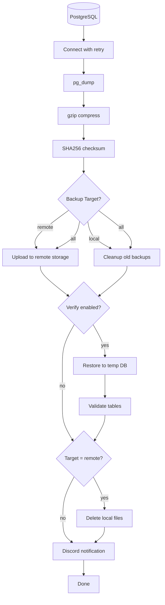

## Design Decisions

### Why Python?
- **Rich ecosystem**: Leverage `boto3` for robust S3 interactions and `psycopg2` for reliable PostgreSQL connections.
- **Better error handling**: Implemented `try/except` blocks with structured logging, avoiding the fragility of Bash scripts and cryptic exit codes.
- **Testable**: The modular design allows for Unit Testing (via `pytest`) and mocking dependencies, ensuring reliability before deployment.

### Why Kubernetes CronJob?
- **Native Scheduler**: Utilizes Kubernetes' built-in scheduler, removing dependencies on external tools like systemd or crond.
- **Ephemeral Efficiency**: Pods run only during the backup window and terminate immediately after, saving cluster resources.
- **Clean Failure Handling**: Uses `restartPolicy: Never` to ensure failed jobs don't restart indefinitely.

### Why Modular Architecture?
- **Separation of Concerns**: Database operations, storage logic, and notifications are isolated in their own modules (`src/database`, `src/storage`, `src/notification`).
- **Maintainability**: Allows swapping backend storage (e.g., S3 to GCS) or notification providers without refactoring the core logic.
- **Testability**: Enable isolated unit testing for each component.

---

## Trade-offs Analysis

| Decision | Choice | Trade-off / Rationale |
|----------|--------|-----------|
| **Compression** | `gzip` over `zstd` | `zstd` is faster, but `gzip` is ubiquitous. This ensures backups can be restored on any standard Linux/Unix system without installing additional tools. |
| **Backup Strategy** | `pg_dump` over `pg_basebackup` | `pg_basebackup` offers faster physical backups with PITR, but `pg_dump` provides logical backups which are version-agnostic and allow for selective table restoration. |
| **Secret Management** | Pre-created K8s Secret | Requires extra step (`kubectl create secret`), but keeps credentials out of Git and Helm values. |
| **Notification** | Discord Webhook | Chosen for simplicity (HTTP POST) over Email (SMTP), eliminating the need for complex mail server configuration. |

---

## Demo

### Kubernetes Deployment
| Deploy | Status | Logs |
|--------|--------|------|
| 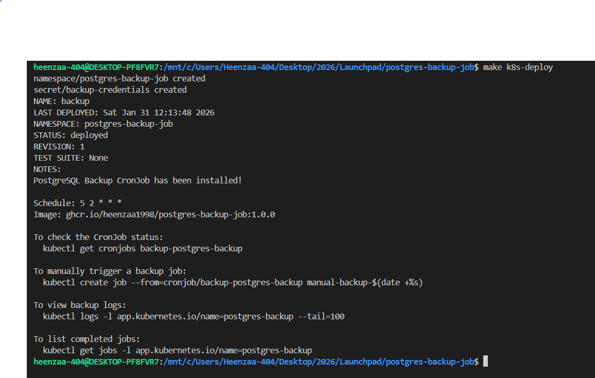 | 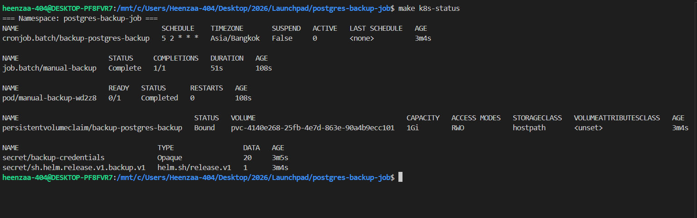 | 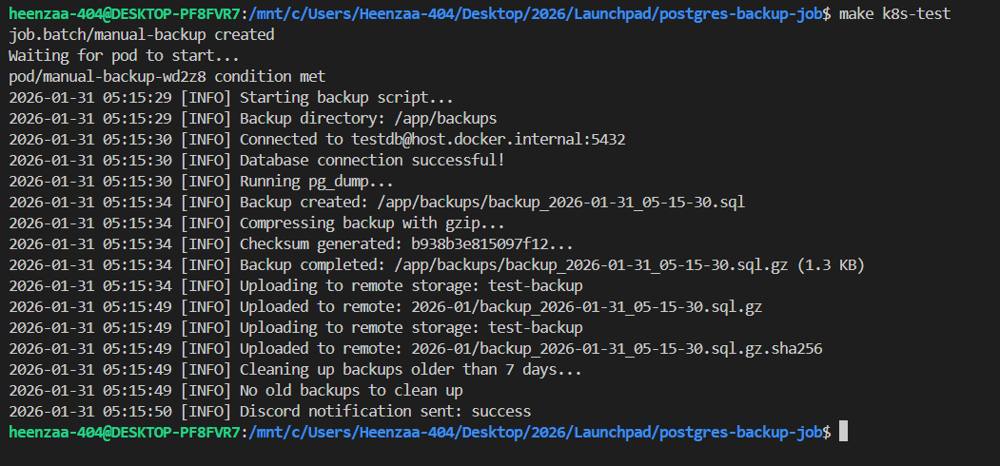 |

### Backup Storage
| PVC (Local) | Remote (S3/MinIO) |
|-------------|-------------------|
| 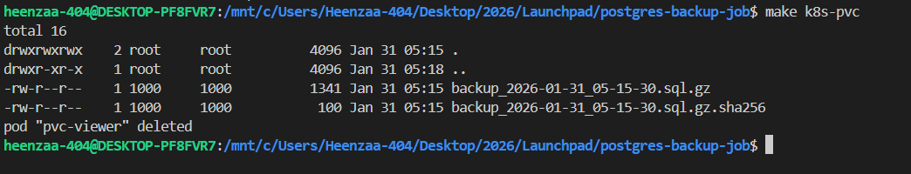 | 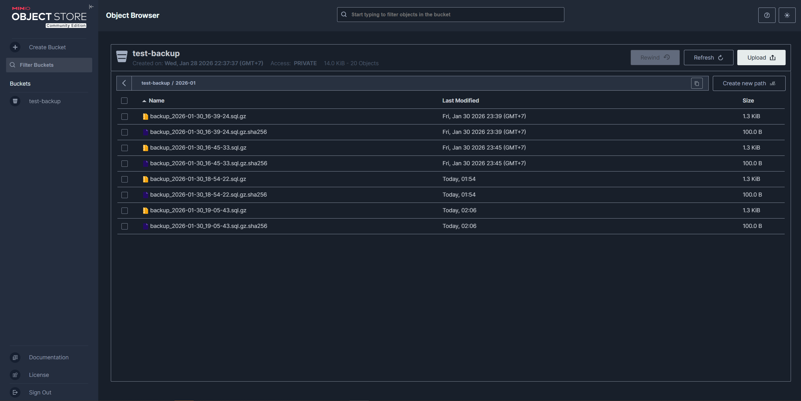 |

### Discord Notifications
| Success | Failure |
|---------|---------|
| 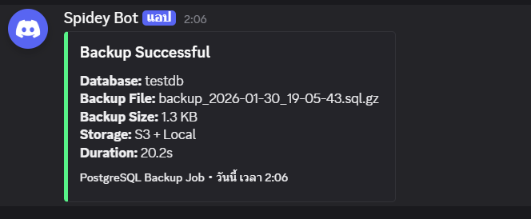 | 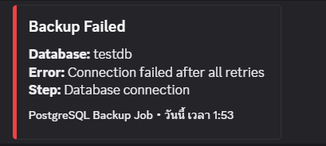 |

### Restore Process
| Download from PVC | Unzip & Restore | Verify Tables |
|-------------------|-----------------|---------------|
| 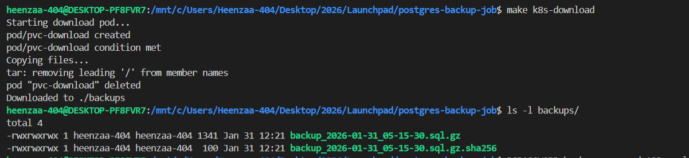 | 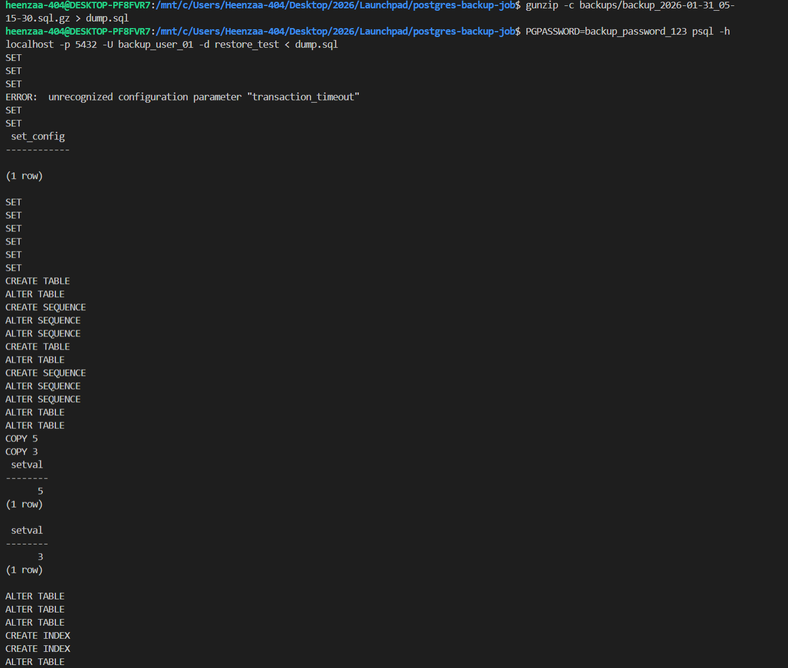 | 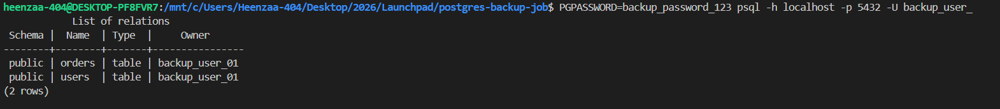 |

---

## Quick Start

```bash
# 1. Configure environment
cp .env.example .env

# 2. Start PostgreSQL (for development)
docker compose up -d

# 3. Install dependencies
pip install -r requirements.txt

# 4. Run backup
python src/backup.py
```

## Configuration

| Variable | Default | Description |
|----------|---------|-------------|
| `POSTGRES_HOST` | localhost | Database host |
| `POSTGRES_PORT` | 5432 | Database port |
| `POSTGRES_USER` | backup_user | Database username |
| `POSTGRES_PASSWORD` | backup_password | Database password |
| `POSTGRES_DB` | testdb | Database name |
| `BACKUP_DIR` | ./backups | Backup output directory |
| `RETRY_COUNT` | 3 | Connection retry attempts |
| `RETRY_DELAY` | 5 | Seconds between retries |
| `RETENTION_DAYS` | 7 | Delete backups older than N days (0=disable) |
| `VERIFY_ENABLED` | false | Enable backup verification |
| `VERIFY_HOST` | POSTGRES_HOST | Verify database host |
| `VERIFY_PORT` | POSTGRES_PORT | Verify database port |
| `VERIFY_USER` | POSTGRES_USER | Verify database user |
| `VERIFY_PASSWORD` | POSTGRES_PASSWORD | Verify database password |
| `VERIFY_DB` | testdb_verify | Temp database for verification |
| `BACKUP_TARGET` | local | Storage target: local, remote, or all |
| `REMOTE_ENDPOINT` | http://localhost:9000 | S3-compatible endpoint |
| `REMOTE_BUCKET` | test-backup | Bucket name |
| `REMOTE_ACCESS_KEY` | minioadmin | Access key |
| `REMOTE_SECRET_KEY` | minioadmin | Secret key |
| `REMOTE_REGION` | us-east-1 | Region |
| `REMOTE_PATH_FORMAT` | monthly | Path format: flat, monthly, or daily |
| `DISCORD_WEBHOOK_URL` | | Discord webhook URL for notifications |
| `DISCORD_NOTIFY_SUCCESS` | true | Send notification on successful backup |
| `DISCORD_NOTIFY_FAILURE` | true | Send notification on failed backup |

> **Production Recommendation:** For production environments, use a **separate PostgreSQL instance** for verification to avoid impacting production performance and to validate backup portability.

<details>
<summary>Example: Separate Verify Instance</summary>

Add to `docker-compose.yml`:

```yaml
postgres-verify:
  image: postgres:16-alpine
  environment:
    POSTGRES_USER: backup_user
    POSTGRES_PASSWORD: backup_password
    POSTGRES_DB: testdb_verify
  ports:
    - "5433:5432"
```

Then set in `.env`:
```bash
VERIFY_HOST=localhost
VERIFY_PORT=5433
```

</details>

> **Remote Retention:** Use S3/MinIO lifecycle policies to automatically delete old backups from remote storage.

### Remote Path Formats

| Format | Example Path |
|--------|--------------|
| `flat` | `backup_2026-01-28.sql.gz` |
| `monthly` | `2026-01/backup_2026-01-28.sql.gz` |
| `daily` | `2026-01-28/backup_2026-01-28.sql.gz` |

## Output

### Normal (no cleanup needed)

```
[INFO] Starting backup script...
[INFO] Connected to testdb@localhost:5432
[INFO] Running pg_dump...
[INFO] Compressing backup with gzip...
[INFO] Backup completed: ./backups/backup_2026-01-28.sql.gz (1.3 KB)
[INFO] Cleaning up backups older than 7 days...
[INFO] No old backups to clean up
[INFO] Verifying backup...
[INFO] Creating temp database: testdb_verify
[INFO] Restoring backup to temp database...
[INFO] Verified: 2 tables found
[INFO] Backup verified successfully
[INFO] Dropping temp database: testdb_verify
```

### With cleanup (old backups deleted)

```
[INFO] Starting backup script...
[INFO] Connected to testdb@localhost:5432
[INFO] Running pg_dump...
[INFO] Compressing backup with gzip...
[INFO] Backup completed: ./backups/backup_2026-01-28.sql.gz (1.3 KB)
[INFO] Cleaning up backups older than 7 days...
[INFO] Deleted old backup: backup_2026-01-20.sql.gz
[INFO] Cleanup complete: 1 file(s) removed
[INFO] Verifying backup...
[INFO] Creating temp database: testdb_verify
[INFO] Restoring backup to temp database...
[INFO] Verified: 2 tables found
[INFO] Backup verified successfully
[INFO] Dropping temp database: testdb_verify
```

## Development Setup

```bash
# Start all services (PostgreSQL + MinIO)
docker compose up -d

# Start only PostgreSQL
docker compose up -d postgres

# Start only MinIO
docker compose up -d minio
```

### Verify Services

```bash
# Check PostgreSQL
docker compose exec postgres psql -U backup_user -d testdb -c "SELECT * FROM users;"

# Check MinIO Console
# Open: http://localhost:9001
# Login: minioadmin / minioadmin
```

## Testing

Run unit tests with pytest:

```bash
# Install test dependencies
pip install pytest pytest-mock

# Run all tests
pytest tests/ -v
```

### Test Coverage

| Module | Tests | Description |
|--------|-------|-------------|
| `config.py` | 3 | Environment variable loading, defaults, verify fallback |
| `checksum.py` | 4 | SHA256 generation, format, reproducibility, error handling |
| `storage.py` | 8 | Directory creation, cleanup, S3 upload |
| `database.py` | 5 | Connection success/failure, retry logic |
| `notification.py` | 5 | Discord embed format, webhook sending, error handling |
| **Total** | **25** | |

## Docker Usage

### Build

```bash
docker build -t postgres-backup-job .
```

### Push

```bash
docker tag postgres-backup-job <your-registry>/postgres-backup-job:v1.0.0
docker push <your-registry>/postgres-backup-job:v1.0.0
```

### Pull

```bash
docker pull <your-registry>/postgres-backup-job:v1.0.0
```

### Run

```bash
docker run --rm --network host \
  --env-file .env \
  <your-registry>/postgres-backup-job:v1.0.0
```

## Kubernetes Deployment

### Helm Chart

Chart location: `charts/postgres-backup/`

```
charts/postgres-backup/
├── Chart.yaml          # Chart metadata
├── values.yaml         # Default configuration
└── templates/
    ├── _helpers.tpl    # Template helper functions
    ├── cronjob.yaml    # CronJob for scheduled backups
    ├── pvc.yaml        # PersistentVolumeClaim for local storage
    ├── secret.yaml     # Optional: credentials (demo only)
    └── NOTES.txt       # Post-install instructions
```

| Template | Description |
|----------|-------------|
| `_helpers.tpl` | Template helper functions (naming, labels) |
| `cronjob.yaml` | Scheduled backup job (default: daily 2am) |
| `pvc.yaml` | Local backup storage (auto-created) |
| `secret.yaml` | Demo credentials (see table below) |

### Configuration

Key values in `values.yaml`:

| Value | Default | Description |
|-------|---------|-------------|
| `schedule` | `5 2 * * *` | Cron schedule |
| `timeZone` | `Asia/Bangkok` | Schedule timezone (requires K8s 1.27+) |
| `persistence.size` | `1Gi` | PVC size |
| `resources.limits.memory` | `256Mi` | Memory limit |
| `resources.limits.cpu` | `100m` | CPU limit |
| `backup.target` | `all` | local, remote, or all |
| `backup.retentionDays` | `7` | Days to keep backups |
| `discord.notifySuccess` | `true` | Send Discord notification on success |
| `discord.notifyFailure` | `true` | Send Discord notification on failure |

**Secret Configuration:**

| Environment | Method |
|-------------|--------|
| Production | `make k8s-secret` |
| Demo/Test | `secret.create: true` |

### Makefile Commands

```bash
make help
```

| Command | Description |
|---------|-------------|
| `k8s-ns` | Create namespace |
| `k8s-secret` | Create secret from .env file |
| `k8s-deploy` | Deploy helm chart |
| `k8s-test` | Trigger backup job and show logs |
| `k8s-logs` | View latest backup logs |
| `k8s-pvc` | List backup files in PVC |
| `k8s-status` | Show all resources status |
| `k8s-download` | Download backups from PVC |
| `k8s-clean` | Delete all resources |

Override variables:

```bash
make k8s-deploy NAMESPACE=production RELEASE=prod IMAGE_TAG=2.0.0
```

### Prerequisites

- Kubernetes cluster (Docker Desktop, minikube, etc.)
- Helm 3.x
- kubectl configured

### Quick Deploy

```bash
# 1. Configure credentials
cp .env.example .env
# Edit .env with your database credentials

# 2. Deploy
make k8s-deploy

# 3. Test backup
make k8s-test

# 4. View backup files
make k8s-pvc
```


## Verify Backup Integrity

Every backup generates a `.sha256` checksum file:

```bash
# Verify checksum
sha256sum -c backup_2026-01-29_22-14-45.sql.gz.sha256
# Output: backup_2026-01-29_22-14-45.sql.gz: OK
```

## Backup Retrieval & Restoration

### Download Backups

Download backups from PVC to local machine:

```bash
make k8s-download
# Files saved to ./backups/
```

### Restore to Database Guide

1. **Verify checksum (optional):**
   ```bash
   cd backups && sha256sum -c backup_YYYY-MM-DD.sql.gz.sha256
   # Output: backup_YYYY-MM-DD.sql.gz: OK
   ```

2. **Decompress backup:**
   ```bash
   gunzip -c backups/backup_YYYY-MM-DD.sql.gz > dump.sql
   ```

3. **Create target database:**
   ```bash
   PGPASSWORD=<password> psql -h <host> -p <port> -U <user> -d postgres -c "DROP DATABASE IF EXISTS <target_db>;"
   PGPASSWORD=<password> psql -h <host> -p <port> -U <user> -d postgres -c "CREATE DATABASE <target_db>;"
   ```

4. **Restore data:**
   ```bash
   PGPASSWORD=<password> psql -h <host> -p <port> -U <user> -d <target_db> < dump.sql
   ```

5. **Verify tables:**
   ```bash
   PGPASSWORD=<password> psql -h <host> -p <port> -U <user> -d <target_db> -c "\dt"
   ```

> **Note:** Replace `<password>`, `<host>`, `<port>`, `<user>`, `<target_db>` with your PostgreSQL credentials. Default port is `5432`.

---

## Challenges & Solutions

| Challenge | Solution |
|-----------|----------|
| **Timezone Consistency** | Docker containers default to UTC. We use Kubernetes 1.27+ `timeZone` field in CronJob spec and Python's `datetime` for consistent filenames. |
| **S3 Signature Errors** | Some MinIO versions reject default boto3 signatures. Solved by forcing `signature_version='s3v4'` in the boto3 client config. |

---

## Demo Environment

- **Cluster**: Docker Desktop Kubernetes (v1.32.2)
- **OS**: Windows 10 (WSL2 integration)
- **Database**: PostgreSQL 16
- **Storage**: MinIO (S3-compatible object storage)

---

## References

- [PostgreSQL pg_dump Documentation](https://www.postgresql.org/docs/current/app-pgdump.html)
- [AWS SDK for Python (Boto3)](https://boto3.amazonaws.com/v1/documentation/api/latest/index.html)
- [Kubernetes CronJob Concepts](https://kubernetes.io/docs/concepts/workloads/controllers/cron-jobs/)
- [Helm Chart Development Guide](https://helm.sh/docs/chart_template_guide/)
- [Kubernetes TimeZone Support (KEP-3140)](https://kubernetes.io/docs/concepts/workloads/controllers/cron-jobs/#time-zones)
